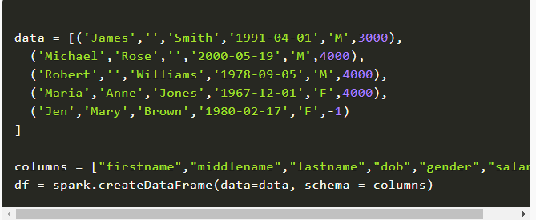
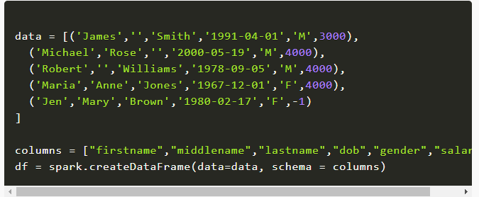
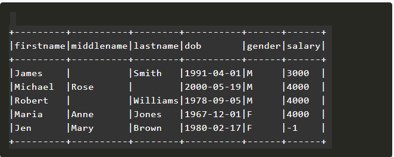

<h1><i>Spark Dataframe </i></h1>
<h3><b>1. Tổng quan DataFrame trong pyspark </b></h3>

Trong Apache Spark, DataFrame là một tập hợp phân tán của các hàng dưới các cột được đặt tên. Nói một cách dễ hiểu, nó giống như một bảng trong cơ sở dữ liệu quan hệ hoặc một trang tính Excel có tiêu đề Cột. Nó cũng chia sẻ một số đặc điểm chung với RDD:

<li><b>Bất biến về bản chất</b>: Chúng ta có thể tạo DataFrame / RDD một lần nhưng không thể thay đổi nó. Và chúng ta có thể chuyển đổi một DataFrame / RDD sau khi áp dụng các phép biến đổi.</li>
<li><b>Đánh giá lười biếng</b>: Có nghĩa là một nhiệm vụ không được thực hiện cho đến khi một hành động được thực hiện.</li>
<li><b>Được phân phối</b>: RDD và DataFrame đều được phân phối trong tự nhiên.</li>
<h3><b>2. Tại sao DataFrames lại hữu ích? </b></h3>

Một số ưu điểm của DataFrames:

<li>DataFrames được thiết kế để xử lý bộ sưu tập lớn dữ liệu có cấu trúc hoặc bán cấu trúc.</li>
<li>Các quan sát trong Spark DataFrame được tổ chức dưới các cột được đặt tên, giúp Apache Spark hiểu được lược đồ của DataFrame. Điều này giúp Spark tối ưu hóa kế hoạch thực thi trên các truy vấn này.</li>
<li>DataFrame trong Apache Spark có khả năng xử lý hàng petabyte dữ liệu.</li>
<li>DataFrame hỗ trợ nhiều định dạng và nguồn dữ liệu.</li>
<li>Nó có hỗ trợ API cho các ngôn ngữ khác nhau như Python, R, Scala, Java.</li>
<h3><b>3. Làm thế nào để tạo một DataFrame?</b></h3>

Một DataFrame trong Apache Spark có thể được tạo theo nhiều cách:

<li>Nó có thể được tạo bằng các định dạng dữ liệu khác nhau. Ví dụ: tải dữ liệu từ JSON, CSV.</li>
<li>Đang tải dữ liệu từ RDD hiện có.</li>
<li>Lược đồ chỉ định theo chương trình</li>

<h4>Tạo DataFrame từ RDD</h4>

Làm theo các bước sau để tạo DataFrame từ danh sách các bộ giá trị:

<li>Tạo một danh sách các bộ giá trị. Mỗi bộ chứa tên của một người có tuổi.</li>
<li>Tạo một RDD từ danh sách trên.</li>
<li>Chuyển đổi từng bộ thành một hàng.</li>
<li>Tạo một DataFrame bằng cách áp dụng createDataFrame trên RDD với sự trợ giúp của sqlContext .</li>

Hãy kiểm tra schemaPeople

<h4>Tạo DataFrame từ tệp CSV</h4>

Cú Pháp:

<h4>Tạo DataFrame từ tệp văn bản</h4>

Cú Pháp:

<h4>Tạo DataFrame từ tệp Json</h4>

Cú Pháp:

<h4>Thao tác DataFrame</h4>

<b>sử dụng createDataFrame()</b>

Bằng cách sử dụng createDataFrame()chức năng của SparkSession, bạn có thể tạo một DataFrame.

Vì DataFrame là định dạng cấu trúc chứa tên và cột, chúng ta có thể lấy lược đồ của DataFrame bằng cách sử dụng df.printSchema()

df.show() hiển thị 20 phần tử từ DataFrame.

<h3>Tài liệu tham khảo<h3>
[link 1](https://spark.apache.org/docs/latest/sql-programming-guide.html)
[link2](https://spark.apache.org/docs/2.4.0/api/python/pyspark.sql.html)
[link3](https://sparkbyexamples.com/pyspark-tutorial/)